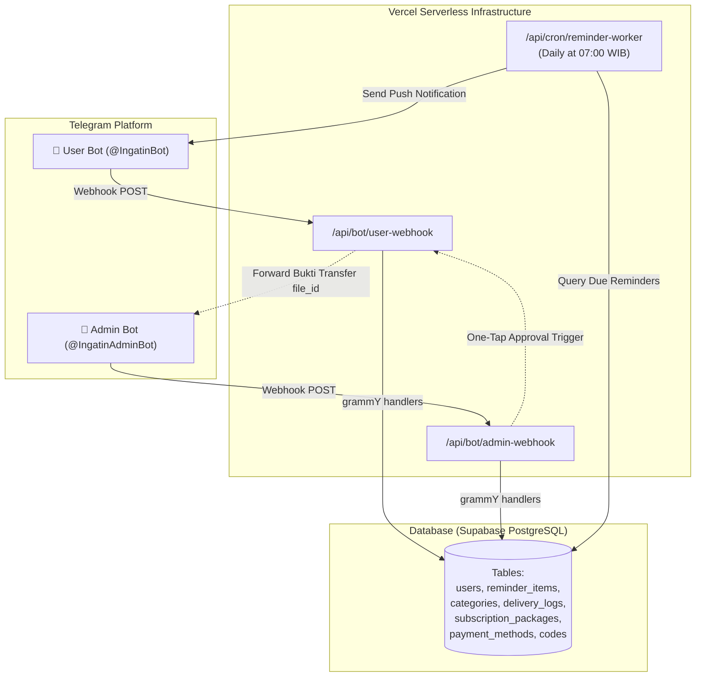

# ⏰ Ingatin: Telegram Reminder SaaS Platform

<div align="center">


**Platform SaaS Asisten Pengingat Berbasis Bot Telegram untuk Memantau Tanggal Jatuh Tempo, Kedaluwarsa, Hari Spesial & Kewajiban Berkala Secara Otomatis.**

[Fitur Utama](#-fitur-utama) •
[Daftar Kategori](#-16-kategori-pengingat-komprehensif) •
[Arsitektur Dual Bot](#-arsitektur-dual-bot) •
[Daftar Perintah](#-daftar-perintah-lengkap) •
[Panduan Instalasi](#-panduan-instalasi--pengembangan-lokal) •
[Deploy Produksi](#-panduan-deploy-ke-vercel-produksi)

</div>

---

## 📖 Tentang Ingatin

**Ingatin** adalah solusi SaaS (*Software-as-a-Service*) modern yang dirancang untuk mencegah kelalaian fatal akibat lupa tanggal jatuh tempo (seperti garansi gadget hangus, denda pajak STNK, paspor mati saat traveling, atau terlewatnya perpanjangan sewa dan momen ulang tahun).

Dibangun dengan pendekatan **Clean Architecture**, **Serverless-First**, dan **Zero Infrastructure Cost** yang berjalan 100% di free-tier Vercel dan Supabase PostgreSQL.

---

## 🌟 Fitur Utama

### 💎 1. Model Bisnis Freemium SaaS
- **Free Trial**: Setiap pengguna baru otomatis mendapatkan kuota gratis hingga **2 item pengingat aktif**.
- **Pro Subscriber**: Akses **tanpa batas (*Unlimited*)** untuk menambah reminder, notifikasi berkala, dan fitur ekspor CSV.
- **Sistem Voucher (*Redeem Engine*)**: Generator kode voucher acak 8 karakter untuk aktivasi instan tanpa verifikasi manual.

### 📅 2. Manajemen & Fleksibilitas Pengingat Cerdas
- **16 Kategori Lengkap**: Mencakup gadget, kendaraan, medis, finansial, ibadah universal, pendidikan, legalitas, hingga tanaman dan hewan peliharaan.
- **Siklus Perulangan Fleksibel (*Multi-Cycle Recurrence*)**:
  - `Sekali Saja` *(Garansi, Paspor)*
  - `Tiap 1 Bulan` *(Sewa Kos, Tagihan IPL/Wifi)*
  - `Tiap 3 Bulan` *(Cuci AC, Ganti Oli Motor, Obat Kutu)*
  - `Tiap 6 Bulan` *(Servis Mobil, Uji KIR, Scaling Gigi)*
  - `Tiap 1 Tahun Masehi` *(STNK, Domain Web, Ulang Tahun)*
  - `Tiap 5 Tahun` *(SIM A/C, Kartu ATM, Paspor)*
  - `Tiap 1 Tahun Hijriyah (~354 Hari)` *(Kurban Idul Adha 10 Dzulhijjah, Haul Zakat Maal)*
- **Smart Hijri Engine**: Konversi otomatis kalender Islam *Umm al-Qura* via `Intl.DateTimeFormat` sehingga pengingat ibadah otomatis maju ~10-11 hari Masehi setiap tahunnya.
- **Auto-Advance pada Hari H**: Item berulang otomatis memajukan tanggal ke siklus berikutnya tanpa perlu input ulang manual.

### 💵 3. Estimasi Anggaran (*Budget Tracking*) & Agenda Bulanan
- **Pencatatan Biaya**: Memasukkan estimasi dana pada item (misal: Pajak Mobil Rp 2.500.000 atau Cuci AC Rp 150.000).
- **Perintah `/agenda`**: Rekap kalender jatuh tempo khusus bulan berjalan lengkap dengan total akumulasi pengeluaran dana yang harus disiapkan.

### ⚡ 4. Tindakan Cepat & Integrasi Kalender
- **1-Klik Simpan ke Google Calendar**: Tombol direct-link URL di setiap notifikasi dan kartu item untuk menambahkan event ke Google Calendar instan tanpa OAuth.
- **Tombol Quick Renew**: Perpanjang item secara instan: `[+1 Bln]`, `[+3 Bln]`, `[+6 Bln]`, `[+1 Thn]`, atau `[⏸️ Snooze +7 Hari]`.
- **Ekspor Data CSV (`/export`)**: Mengunduh seluruh database pengingat pengguna ke file spreadsheet.

### 🤖 5. Panel Admin & Pengelolaan Pembayaran
- **Dual Telegram Bot**: Bot Pengguna terpisah dari Bot Admin untuk menjaga keamanan dan efisiensi.
- **Persetujuan Pembayaran 1-Klik**: Bukti transfer diteruskan langsung via Telegram `file_id` (tanpa storage pihak ketiga); Admin cukup menekan tombol `[Approve 1 Tahun]` atau `[Approve Lifetime]`.
- **Broadcast & Tiket Bantuan**: Admin dapat membalas tiket bantuan `/contact` secara langsung (`/reply <id> <pesan>`) dan mengirim pesan massal (`/broadcast <pesan>`).

### 🛡️ 6. Keamanan & Performa Tinggi
- **Zero Duplicate Alerts (Idempotency)**: Tabel `reminder_delivery_logs` menjamin notifikasi tidak pernah terkirim ganda meskipun cron mengalami *retry*.
- **Anti-Spam Sliding Window Rate Limiter**: Proteksi *flood control* 3 request/2s, anti-flood media 15s, dan kuota tiket support 3 pesan/24 jam.

---

## 🗂️ 16 Kategori Pengingat Komprehensif

| Kategori | Icon | Contoh Item Nyata | Default Alert (H-) |
| :--- | :---: | :--- | :---: |
| **Ulang Tahun & Anniversary** | 🎂 | Ulang tahun pasangan, orang tua, hari pernikahan | H-14, 7, 3, 1, 0 |
| **Pajak STNK & SIM Kendaraan** | 🚗 | Pajak tahunan, STNK 5 tahunan, SIM A/C | H-30, 14, 7, 3, 1, 0 |
| **Servis AC, Kendaraan & Rumah** | 🛠️ | Cuci AC, ganti oli mesin, filter air, servis rutin | H-14, 7, 3, 1, 0 |
| **Kesehatan, Obat & Perawatan** | 💊 | Obat resep rutin, scaling gigi, MCU tahunan, booster | H-14, 7, 3, 1, 0 |
| **Kartu ATM, Finansial & Tagihan**| 💳 | Expired kartu debit/kredit, jatuh tempo deposito, cicilan | H-14, 7, 3, 1, 0 |
| **Ibadah, Donasi & Hari Keagamaan**| 🕊️ | Kurban Idul Adha, Zakat Maal, Persepuluhan, Natal, Nyepi | H-30, 14, 7, 3, 0 |
| **Karier, Pajak SPT & Kontrak** | 👔 | Batas lapor SPT tahunan, probation kerja, SKCK | H-30, 14, 7, 3, 1, 0 |
| **Pendidikan, SPP & UKT Kuliah** | 🎓 | Uang semesteran UKT, SPP bulanan sekolah anak | H-30, 14, 7, 3, 1, 0 |
| **Garansi Gadget & Elektronik** | 💻 | Laptop, HP, iPad, TV, kulkas, AC, mesin cuci | H-30, 7, 3, 1, 0 |
| **Paspor, Visa & Lisensi Profesi**| 📄 | Paspor, STR Dokter/Nakes, KTA Advokat, Sertifikat K3 | H-60, 30, 14, 7, 0 |
| **Travel, Visa & Poin/Miles** | ✈️ | Expired visa turis, masa berlaku GarudaMiles/KrisFlyer | H-14, 7, 3, 1, 0 |
| **Domain, Hosting & Subscription**| 🌐 | Domain web, server VPS, SSL, Netflix, Spotify | H-14, 7, 3, 1, 0 |
| **Sewa Properti, Kos & Tagihan** | 🏠 | Sewa rumah, kos bulanan, PBB tahunan, IPL apartemen | H-30, 14, 7, 3, 1, 0 |
| **Tanaman & Perawatan Kebun** | 🪴 | Pemupukan rutin, ganti media tanam / repotting | H-7, 3, 1, 0 |
| **Perawatan Hewan Peliharaan** | 🐾 | Obat cacing & kutu kucing/anjing, vaksin rabies | H-7, 3, 1, 0 |
| **Lainnya / Kebutuhan Pribadi** | 📌 | Kebutuhan kustom pengguna | H-30, 7, 3, 1, 0 |

---

## 🏗️ Arsitektur Dual Bot & Alur Sistem



---

## ⌨️ Daftar Perintah Lengkap

### 👤 User Bot Commands
| Perintah | Deskripsi |
| :--- | :--- |
| `/start` | Menampilkan pesan sambutan, status akun, dan menu navigasi utama. |
| `/add` | Membuka Wizard Interaktif 6 Langkah untuk mencatat item baru. |
| `/list` atau `/reminders` | Melihat daftar semua reminder aktif dengan status urgensi dan tombol detail. |
| `/agenda` atau `/upcoming` | Rekapitulasi agenda jatuh tempo bulan ini & estimasi pengeluaran dana. |
| `/profile` atau `/status` | Cek sisa kuota, status langganan (*Free Trial* / *Pro*), dan sisa masa aktif. |
| `/subscribe` | Menampilkan pilihan paket berlangganan dan invoice pembayaran (BCA / QRIS). |
| `/redeem <code>` | Mengaktifkan paket langganan menggunakan kode voucher 8 karakter. |
| `/export` | Mengunduh seluruh data reminder pengguna ke file spreadsheet (CSV). |
| `/contact <pesan>` | Mengirim tiket bantuan/pertanyaan ke tim Admin (Maksimal 3 pesan/hari). |
| `/help` | Panduan lengkap penggunaan bot dan daftar perintah. |

### 👑 Admin Bot Commands
| Perintah | Deskripsi |
| :--- | :--- |
| `/start <master_code>` | Autentikasi dan promosi user menjadi Administrator bot. |
| `/admin_stats` | Melihat analitik bisnis: Total user, subscriber aktif, total reminder, dan konfirmasi pending. |
| `/users [keyword]` | Mencari dan melihat daftar pengguna beserta status langganannya. |
| `/extend <user_id> <hari>`| Menambah masa aktif pengguna secara manual (`0` untuk Lifetime). |
| `/reply <user_id> <pesan>`| Membalas tiket bantuan `/contact` langsung ke chat Telegram pengguna. |
| `/broadcast <pesan>` | Mengirim pesan pengumuman/promo massal ke seluruh pengguna terdaftar. |
| `/packages` | Melihat dan mengelola paket langganan yang aktif. |
| `/payments` | Melihat metode pembayaran dan rekening bank yang tersedia. |
| `/add_qris` | Mengunggah gambar QRIS pembayaran baru. |
| `/generate_code <hari>` | Menghasilkan kode voucher unik 8 karakter untuk dibagikan ke customer. |

---

## 🛠️ Panduan Instalasi & Pengembangan Lokal

### 1. Prasyarat Sistem
- **Node.js**: Versi 18.0.0 atau lebih baru
- **NPM** atau **PNPM**
- **Dua Bot Telegram**: Buat 2 bot di [@BotFather](https://t.me/BotFather) (User Bot & Admin Bot)
- **Supabase Account**: Project PostgreSQL gratis di [supabase.com](https://supabase.com)

### 2. Clone & Install Dependencies
```bash
git clone https://github.com/hanifalkauni/telegram-reminder-bot.git
cd telegram-reminder-bot
npm install
```

### 3. Migrasi Database Supabase
1. Masuk ke **Supabase Dashboard** -> Pilih Project Anda.
2. Buka menu **SQL Editor** -> Buat *New Query*.
3. Salin seluruh isi file [`src/db/schema.sql`](src/db/schema.sql) dan jalankan (**Run**).

### 4. Konfigurasi Environment Variables
Salin file `.env.example` menjadi `.env`:
```bash
cp .env.example .env
```
Isi variabel berikut di `.env`:
```env
# Token Telegram Bot
BOT_TOKEN_USER=1234567890:ABCdefGhIJKlmNoPQRsTUVwxyZ
BOT_TOKEN_ADMIN=9876543210:ZYXwvuTsRQPonMLkJIhGFEdcba

# Supabase Credentials (Gunakan Service Role Key)
SUPABASE_URL=https://your-project.supabase.co
SUPABASE_SERVICE_ROLE_KEY=eyJhbGciOiJIUzI1NiIsInR5cCI6IkpXVCJ9...

# Keamanan Webhook & Cron
ADMIN_MASTER_CODE=TEMPO_ADMIN_SECRET_2026
TELEGRAM_SECRET_TOKEN=random_secure_token_for_webhook
CRON_SECRET=random_secure_token_for_cron
```

### 5. Menjalankan di Mode Lokal (Long Polling)
Buka 2 terminal terpisah:
```bash
# Terminal 1: Menjalankan Bot Pengguna
npm run dev:user

# Terminal 2: Menjalankan Bot Admin
npm run dev:admin
```

---

## 🚀 Panduan Deploy ke Vercel (Produksi)

### 1. Deploy ke Vercel
1. Push project Anda ke repository GitHub.
2. Hubungkan repository ke [Vercel Dashboard](https://vercel.com).
3. Masukkan seluruh konfigurasi dari file `.env` ke menu **Environment Variables** di Vercel.
4. Klik **Deploy**.

### 2. Daftarkan Webhook Telegram
Setelah mendapatkan domain dari Vercel (contoh: `https://ingatin.vercel.app`), jalankan request berikut di browser atau terminal:

**User Bot Webhook:**
```
https://api.telegram.org/bot<BOT_TOKEN_USER>/setWebhook?url=https://ingatin.vercel.app/api/bot/user-webhook&secret_token=<TELEGRAM_SECRET_TOKEN>
```

**Admin Bot Webhook:**
```
https://api.telegram.org/bot<BOT_TOKEN_ADMIN>/setWebhook?url=https://ingatin.vercel.app/api/bot/admin-webhook&secret_token=<TELEGRAM_SECRET_TOKEN>
```

### 3. Vercel Cron Otomatis
File [`vercel.json`](vercel.json) sudah terkonfigurasi untuk mengeksekusi worker pengingat setiap hari pada pukul **07:00 WIB** (`00:00 UTC`):
```json
{
  "crons": [
    {
      "path": "/api/cron/reminder-worker",
      "schedule": "0 0 * * *"
    }
  ]
}
```

---

## 📁 Struktur Direktori Proyek

```text
telegram-reminder-bot/
├── api/                             # Serverless Endpoints (Vercel Functions)
│   ├── bot/
│   │   ├── user-webhook.ts          # Endpoint Webhook User Bot
│   │   └── admin-webhook.ts         # Endpoint Webhook Admin Bot
│   └── cron/
│       └── reminder-worker.ts       # Endpoint Cron Pengingat Harian (07:00 WIB)
├── src/
│   ├── bot-user/                    # Logika User Bot (grammY)
│   │   ├── commands/index.ts        # /start, /list, /agenda, /profile, /export, dll
│   │   ├── conversations/           # Interactive Wizard /add (6 Langkah)
│   │   ├── handlers/index.ts        # Callback Queries, Quick Renew, Google Calendar
│   │   └── index.ts                 # Inisialisasi User Bot & Middlewares
│   ├── bot-admin/                   # Logika Admin Bot (grammY)
│   │   ├── commands/index.ts        # /admin_stats, /users, /extend, /broadcast, dll
│   │   ├── handlers/index.ts        # One-Tap Approval Bukti Transfer
│   │   └── index.ts                 # Inisialisasi Admin Bot
│   ├── config/                      # Environment & Konstanta Aplikasi
│   │   ├── env.ts                   # Validasi Zod Runtime Envs
│   │   └── constants.ts             # Quota, Icons, Rate Limits
│   ├── db/                          # Database & Supabase Client
│   │   ├── schema.sql               # PostgreSQL DDL & Seed Data
│   │   └── supabase.ts              # Supabase Client Singleton
│   ├── dev/                         # Skrip Pengujian Lokal (Long Polling)
│   │   ├── user-polling.ts
│   │   └── admin-polling.ts
│   ├── middlewares/                 # Auth Guards & Rate Limiter
│   │   ├── authGuard.ts             # Validasi Hak Akses Admin
│   │   └── rateLimiter.ts           # Token Bucket Anti-Flood Middleware
│   ├── services/                    # Business Logic Services
│   │   ├── accessControl.ts         # Manajemen Akses, Kuota & Upgrade
│   │   ├── notificationService.ts   # Cron Dispatcher, Idempotency & Expiry Warning
│   │   ├── reminderService.ts       # CRUD Reminder, Quick Renew, Monthly Agenda
│   │   └── subscriptionService.ts   # Paket, Pembayaran, Voucher Generator
│   ├── types/                       # Definisi Tipe TypeScript Database & Bot
│   │   └── database.ts
│   └── utils/                       # Helpers & Utility Functions
│       ├── dateHelper.ts            # Parser Tanggal, Selisih Hari, Hijri Engine
│       └── telegramHelper.ts        # Format Kartu, Google Calendar URL, Escape HTML
├── .env.example                     # Template Variabel Lingkungan
├── .gitignore                       # Rule Git Ignore
├── package.json                     # Konfigurasi Dependensi & Scripts
├── tsconfig.json                    # Konfigurasi TypeScript NodeNext
├── vercel.json                      # Konfigurasi Vercel Serverless & Cron
└── README.md                        # Dokumentasi Komprehensif Proyek
```

---

## 📜 Lisensi
Project ini dilisensikan di bawah **ISC License**. Bebas dimodifikasi dan dideploy untuk keperluan personal maupun komersial SaaS.
